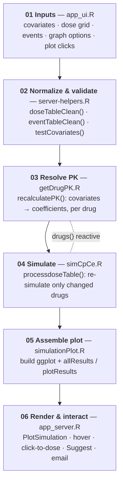

# stanpumpR — Architecture

A visual version of this map is in [`architecture.html`](architecture.html) (open in a
browser). This document is the GitHub-rendered equivalent.

stanpumpR is a Shiny web app that turns a table of drug doses plus a patient's covariates into
predicted **plasma** and **effect-site** concentration curves — using **closed-form**
pharmacokinetic solutions rather than a numeric ODE solver. It is packaged as a standard R
package with a golem-style `ui / server / run` split; the entry point is
`app.R → stanpumpR::run_app()`.

| | |
|---|---|
| Language | R — developed/deployed on 4.6.1 (min declared ≥ 4.1) |
| Framework | Shiny + bslib (Bootstrap 5) |
| Structure | R package, ~60 files in `R/` |
| Drug library | 23 drugs, data-as-code |
| Deps lock | renv (`renv.lock`) |
| Config | `config.yml` merged over `DEFAULT_CONFIG` |

## The request → render pipeline

Everything is one reactive dependency chain inside `R/app_server.R`. An edit — a covariate, a
dose cell, a graph option — invalidates one link, and Shiny re-runs only what is downstream.
The heavy computation is the last two stages.

Both `recalculatePK()` and `processdoseTable()` mutate a persistent per-drug list and **skip
any drug whose inputs are unchanged**. Combined with closed-form solutions (no integration), a
single dose edit re-simulates just the one drug it touched.

### Key reactives (in `app_server.R`)

| Reactive | Role |
|---|---|
| `doseTableClean()` / `eventTableClean()` | coerce grids, drop blank rows, convert clock→elapsed time |
| `testCovariates()` / `weight()` `height()` `age()` `sex()` | validated patient values |
| `plotInfo()` → `plotMaximum()`, `steps()` | x-axis extent derived from doses/events |
| `drugs()` | **A:** `recalculatePK()` then **B:** `processdoseTable()` |
| `simulationPlotRetval()` | calls `simulationPlot()`; exposes `plotObject`, `allResults`, `plotResults`, `plotHeight` |

## The computational core

stanpumpR never numerically integrates. Each drug is a 3-compartment mammillary model with an
effect-site link; disposition is solved analytically once per patient, then evaluated at every
time point as a sum of exponentials.

### A — Parameterize the patient (`getDrugPK.R`)

1. `eval(call(drug, weight, height, age, sex))` runs the drug's own covariate model → `v1..v3`, `cl1..cl3`, `tPeak`, `MEAC`.
2. Volumes & clearances → micro rate constants `k10, k12, k13, k21, k31`.
3. `cube()` solves the characteristic cubic → eigenvalues `lambda_1, lambda_2, lambda_3`.
4. `tPeakError()` + `optimize()` back-solve the effect-site rate `ke0` from time-to-peak-effect.
5. Precompute per-route (bolus / infusion / PO / IM / IN) exponential coefficients `p_coef_*`, `e_coef_*`.

### B — Advance the doses (`simCpCe.R`)

1. Reduce mg/mcg/ng, per-kg, per-hour doses to base units.
2. Classify each dose as bolus, infusion, or `PO / IM / IN`.
3. Dispatch to a solver:
   - `advanceClosedForm0.R` — IV, no PK events
   - `advanceClosedForm1.R` — time-varying PK driven by events
   - `advanceClosedFormPO_IM_IN.R` — extravascular routes
4. Sum each dose's contribution over the exponential basis; `convertState.R` carries state across event boundaries.
5. Interpolate to an even grid (`equiSpace`), normalize to peak Cp/Ce, and scale against MEAC.

Output per drug: a tidy `Time · Plasma · Effect Site · Recovery` table plus `equiSpace` and `max`.

The exported, Shiny-free entry point for this whole path is
`simulateDrugsWithCovariates()` (used by the vignettes and tests).

## Drug library — data as code

Adding a drug means one `R/drugs_<name>.R` file plus one row in the defaults CSV. See
**[adding-a-drug.md](adding-a-drug.md)** for the full procedure.

- **Model** — `R/drugs_*.R` (23 files): each exports `drug(weight, height, age, sex)` returning compartment `PK`, `tPeak`, `MEAC`. Bodies encode published covariate models (often branching on BMI or sex). Invoked by name via `eval(call(drug, ...))`.
- **Metadata** — `inst/extdata/drugDefaults_global.csv`: colors, units, typical ranges, MEAC, emergence thresholds. Loaded once via memoised `getDrugDefaultsGlobal()`; the `Drug` column *is* the drug list.
- **Events** — `inst/extdata/eventDefaults.csv`: named clinical events that can switch a drug to alternate PK mid-simulation.

## Component catalog (`R/` by responsibility)

Files are flat in `R/` and wired by the `Collate:` order in `DESCRIPTION`.

**Shell — bootstrap & framework**
`app.R`, `app_run.R` (`run_app()`), `app_ui.R`, `app_server.R` (the reactive heart),
`app_globals.R` (init tables, bookmark exclusions, `outputComments()`),
`globalVariables.R`, `zzz.R`, `stanpumpR-package.R`.

**Reactive glue — server helpers & UI widgets**
`server-helpers.R` (`recalculatePK`, `cleanDT`, `checkNumericCovariates`), `shiny-utils.R`,
`createHOT.R` (the `rhandsontable` dose grid), `processdoseTable.R`, `validateDose.R`,
`validateTime.R`.

**PK/PD engine — the math core**
`getDrugPK.R`, `cube.R`, `simCpCe.R`, `advanceClosedForm0/1/PO_IM_IN.R`,
`advanceState.R`, `advanceStatePO.R`, `convertState.R`, `CE.R`, `calculateCe.R`,
`tPeakError.R`, `modelInteraction.R`, `recoveryCalc.R`, `lbmJames.R`,
`simulateDrugsWithCovariates.R`.
*Experimental (tracked, not yet integrated):* `ig_absorption.R` — a closed-form Inverse
Gaussian absorption model; not exported or wired into the engine (see its provenance header).

**Output — plot, dosing advisor & export**
`simulationPlot.R`, `setLinetypes.R`, `suggest.R` (target-controlled dosing optimizer),
`sendSlide.R` (renders an `officer` PPTX from `Template.pptx`, emails via `mailR`).

**Util — time & misc**
`clockTimeToDelta.R`, `deltaToClockTime.R`, `hourMinute.R`, `utils.R`,
`drugAndEventDefaults.R`.

## Around the core

- **Suggest Dosing** (`suggest.R`) — optimizes bolus + infusion to reach/hold a target concentration.
- **Email a slide** (`sendSlide.R`) — branded PPTX of the current simulation plus a URL that reconstructs the state.
- **Editors & modals** — in-app Drug Library and Drug Thresholds editors; click-to-add-dose / double-click-to-edit from plot coordinates.
- **URL bookmarking** — `enableBookmarking = "url"`; `bookmarksToExclude` keeps transient UI state out of the link.
- **Debug & profiler** — `?debug=1` reveals a live log (`outputComments`) and a per-reactive profiler (`profileCode`).
- **Front-end assets** — `inst/www/`: `app.css`, `app.js`, `hot_funs.js` (Handsontable hooks, drug-default injection).
- **Reproducibility** — `renv.lock` pins package versions; deps declared in `DESCRIPTION`.
- **Tests / CI** — ~40 files in `tests/testthat/` (one per drug plus PK, plotting, helper suites); R-CMD-check via GitHub Actions.

---

*Generated from `master`. If the code has drifted from this map, update it — it lives with the
code so it can be kept honest.*
